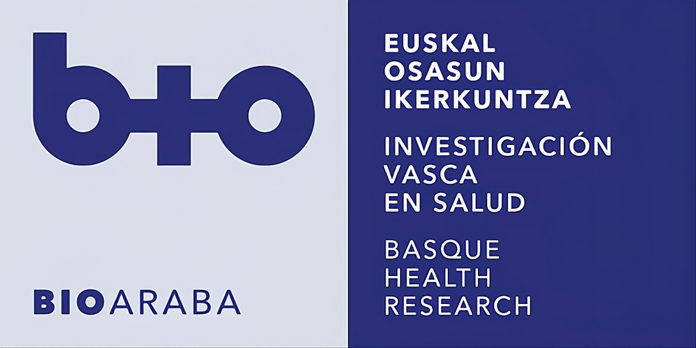
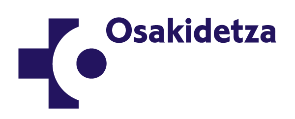
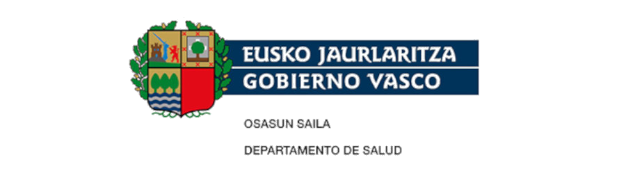

<table border="0">
  <tr>
    <td rowspan="2" width="60%">
      
    </td>
    <td width="40%">
      
    </td>
  </tr>
  <tr>
    <td>
      
    </td>
  </tr>
</table>

# Instituto de Investigación Sanitaria Bioaraba 
> Unidad de Apoyo a la Innovación 

## 🔬 Transformamos ciencia y tecnología en soluciones de salud

Damos servicio a todo el Territorio Histórico de Araba/Álava dentro del ámbito del Servicio Vasco de Salud Osakidetza y la Red de Salud Mental.

## 🚀 Nuestra actividad

Nos centramos en la Línea de Tecnologías Disruptivas para la Salud:

* **Robótica:** Integración de sistemas ciberfísicos.
* **IA & Visión:** Inteligencia Artificial embebida y sistemas de visión por computador.
* **Hardware:** Prototipado electrónico y desarrollo de hardware a medida.
* **Fabricación Digital:** Diseño 3D, simulación (VR/XR) y fabricación aditiva.

## 📍 Ubicación

H.U.A. Sede Txagorritxu (Planta 4ª, Área C) C/ Jose Atxotegi, s/n, 01009 Vitoria-Gasteiz, Araba/Álava.

---

 
	
Nuestros proyectos destacados

	 
	<ul>
	<li><b>Proyecto Saaki:</b> Robótica humanoide sanitaria - Unitree G1 EDU</a></li>
			<ul>
        <li><a href="https://github.com/UAI-BIOARABA/saaki">Documentación y repositorios</a></li>
			</ul>
	</ul>

