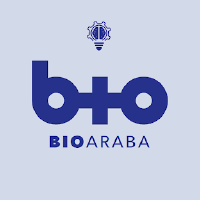
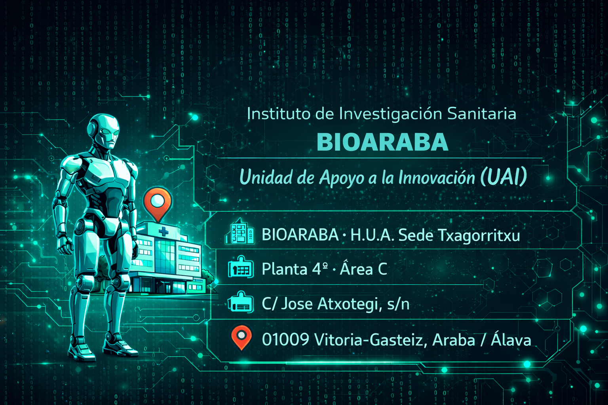

  

# Unidad de Apoyo a la Innovación  
## Instituto de Investigación Sanitaria Bioaraba

---

## 🎯 Misión

* Impulsar el **desarrollo y la transferencia de tecnologías innovadoras** al ámbito sanitario.
* Actuar como espacio de **colaboración con profesionales y empresas**.
* Integrar conocimiento en **ciencias básicas y aplicadas** dentro del ecosistema Bioaraba.

## 👁️ Visión

* Transformar la **investigación y el talento** de las **OSI Araba y Rioja Alavesa** y la **Red de Salud Mental**
* En **soluciones tecnológicas** que generen:

  - [x] Valor en salud
  - [x] Optimización de recursos
  - [x] Retorno para el sistema sanitario

## 🏥 Nuestro propósito

* Ser un **puente tecnológico** entre la innovación de vanguardia y su aplicación práctica en salud.

---

## 🧠 Línea de Tecnologías Disruptivas para la Salud

Exploramos y desarrollamos tecnologías en la frontera de la innovación con aplicación directa al sector sanitario.
Estas son nuestras principales capacidades técnicas:

* 🤖 Integración de sistemas ciberfísicos y robótica

* 🔌 Prototipado electrónico y desarrollo de hardware

* 🖨️ Diseño 3D, simulación (VR/XR) y fabricación digital

* 👁️ IA embebida y visión por computador

---

## 📍 Contacto

H.U.A. Sede Txagorritxu · Planta 4ª · Área C  
C/ Jose Atxotegi, s/n · 01009 Vitoria-Gasteiz · Araba / Álava

  

